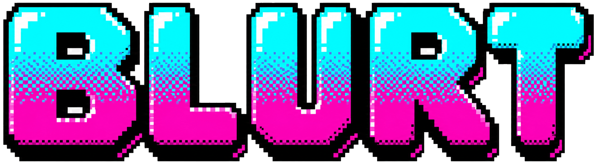
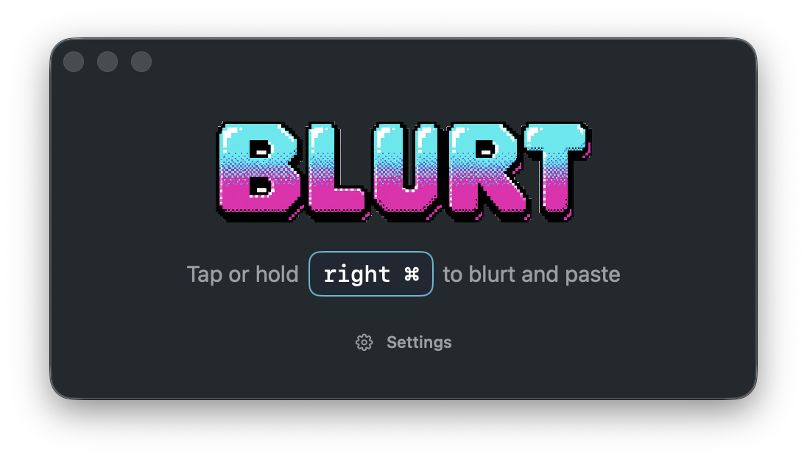

<div align="center">
  <picture>
    <source srcset=".github/images/blurt-logo-ansi.webp" type="image/webp" />
    
  </picture>

  <h2>Free, open-source dictation for your Mac</h2>

  <p>
    <strong>
      Hold a key, talk, and the words land in whatever you're typing. One tool,
      one job. No subscription, no account, no middleman — audio goes straight
      from your Mac to AssemblyAI with your own key, and you can read every
      line of code that sends it.
    </strong>
  </p>

  <p>
    <a href="https://github.com/AssemblyAI/blurt/releases/latest/download/Blurt.dmg">
      
    </a>
  </p>

  <p>
    <a href="https://github.com/AssemblyAI/blurt/releases/latest">
      
    </a>
    <a href="https://www.assemblyai.com">
      
    </a>
  </p>

  <p>
    <sub>MIT licensed · No subscription · Signed &amp; notarized · Bring your
    own AssemblyAI API key</sub>
  </p>



</div>

## Install

1. [Download **Blurt.dmg**](https://github.com/AssemblyAI/blurt/releases/latest/download/Blurt.dmg).
2. Open the disk image and drag **Blurt.app** into `Applications`.
3. Launch Blurt and follow setup: Microphone, Accessibility, and your [AssemblyAI API key](https://www.assemblyai.com/dashboard/api-keys).
4. Dictate with **right command** by default. Tap to toggle, or hold for push-to-talk.

Blurt needs macOS 15 or later on Apple Silicon, plus an AssemblyAI API key
(free tier available).

## Why Blurt

- **Zero dependencies.** Plain Swift on Apple's frameworks — no packages you've never heard of, no supply chain to audit. Fork it and make it yours.
- **No telemetry.** No analytics, no crash reporting, no accounts. Blurt talks to exactly one server, and you can read the code that does it.
- **Native Mac app.** Not a web page in a window. A small Mac app that starts fast, stays out of the way, and types into whatever has focus.
- **Accurate transcription.** Speech in, clean text out — usually in about a tenth of a second, with [30% fewer hallucinations than Whisper](https://www.assemblyai.com/docs/pre-recorded-audio/benchmarks). You pay AssemblyAI directly for what you use.
- **18 languages.** Dictate in 18 languages, not just English — and code-switch mid-sentence. The model follows you between languages without touching a setting.
- **Real synth cues.** Start and stop sounds from a real Yamaha DX7 and Roland Juno-106. There's an off switch, but why would you.

## Privacy

Blurt stores your API key in the macOS Keychain. Audio is captured only while
you are dictating, then sent over HTTPS to AssemblyAI for transcription. Blurt
stores no audio and no transcripts, and sends no telemetry — no crash
reporting, no analytics, no usage tracking.

Because transcription is processed by AssemblyAI, their
[Privacy Policy](https://www.assemblyai.com/legal/privacy-policy) and
[Terms of Service](https://www.assemblyai.com/legal/terms-of-service) apply to
that audio.

## Build from source

Blurt is MIT-licensed. [`AGENTS.md`](./AGENTS.md) has the architecture notes and
build workflow.

```bash
scripts/bootstrap.sh   # install the local toolchain
scripts/dev-build.sh   # build + install Blurt to /Applications
scripts/check.sh       # full repo health check
```

Want to build your own Swift dictation app from scratch? The pipeline —
mic capture, AssemblyAI Sync transcription, and paste-into-the-focused-app —
is a standalone, dependency-free Swift package you can embed:
[`BLURTENGINE.md`](./BLURTENGINE.md) is the developer guide.
