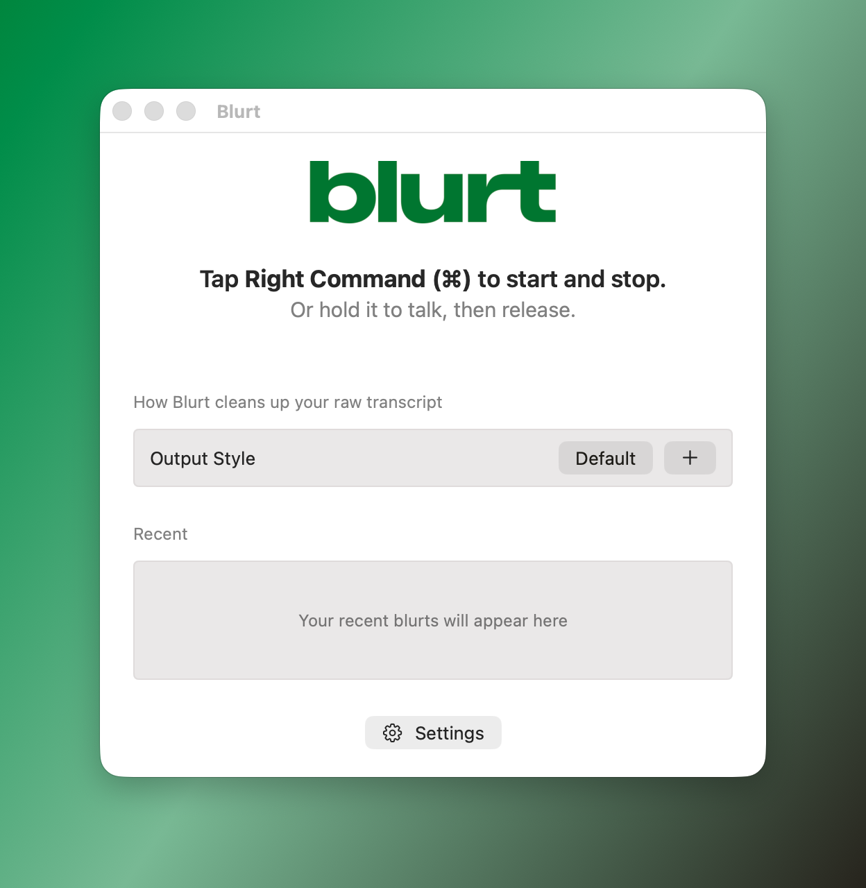

<div align="center">
  <picture>
    <source
      media="(prefers-color-scheme: dark)"
      srcset=".github/images/blurt-logo-dark.png"
    />
    
  </picture>

  <h2>Free, open-source dictation for your Mac</h2>

  <p>
    <strong>
      Hold a key, talk, and the words land in whatever you're typing. One tool,
      one job. No subscription, no account, no middleman — audio goes straight
      from your Mac to AssemblyAI with your own key, and you can read every
      line of code that sends it.
    </strong>
  </p>

  <p>
    <a href="https://github.com/AssemblyAI/blurt/releases/latest/download/Blurt.dmg">
      
    </a>
  </p>

  <p>
    <a href="https://www.assemblyai.com/blurt"><strong>assemblyai.com/blurt</strong></a>
  </p>

  <p>
    <a href="https://github.com/AssemblyAI/blurt/releases/latest">
      
    </a>
    <a href="https://www.assemblyai.com">
      
    </a>
  </p>

  <p>
    <sub>MIT licensed · No subscription · Signed &amp; notarized · Bring your
    own AssemblyAI API key</sub>
  </p>



</div>

Tap a key, speak, and clean text lands in whatever Mac app has focus — think
the built-in macOS dictation, but fast, accurate, and working everywhere you
can type.

To _blurt_ is to say something suddenly, without stopping to think — which is
more or less what this app lets you do to your Mac.

Built entirely native (AppKit + SwiftUI — no Electron, no web views). The whole
pipeline lives in **BlurtEngine**, a dependency-free Swift 6 package: mic
capture, one synchronous `POST` to
[AssemblyAI's dictation API](https://www.assemblyai.com), and a clipboard paste
into the focused app. No local models, no upload-then-poll job queue, no
background daemons — audio in, polished text out, one HTTP request per
utterance.

## Features

- **Works anywhere you can type** — the transcript is pasted into the focused
  app via a synthesized ⌘V, with your prior clipboard contents saved and
  restored around it. If the target app quit while you were speaking, the text
  stays on the clipboard instead of vanishing.
- **One key, no chords** — dictation is triggered by a single lone modifier
  (right ⌘ by default; right ⌥ and `fn` also available). Tap to toggle, hold
  for push-to-talk — or narrow it to tap-only or hold-only in Settings. The
  event tap swallows nothing: a lone modifier types nothing anyway, and combos
  like ⌘C pass through untouched.
- **Polished in one step** — each utterance rides to AssemblyAI's dictation API
  with a little context and nothing more; the same call runs a server-side LLM
  cleanup (disfluencies out, punctuation fixed), so the text comes back already
  polished. No second request, no model downloads. The context is what makes the
  transcript continue naturally — your recent dictations and the text just before
  your cursor — and nothing else about your screen goes with it: not the app, not
  the window title, not the field, not your selection. See
  [Privacy](#privacy).
- **Styles** — save up to four custom styles, each a short set of free-text
  instructions ("always write in lowercase"), and switch between them from the
  **Style** menu in the main window; the selected style shapes that same
  server-side cleanup. Turn off **Enhanced transcripts** in Settings → Styles to
  paste the verbatim transcript instead.
- **Your vocabulary** — key terms bias the spelling of names and jargon, and text
  shortcuts swap a spoken phrase for saved text (say "personal email", get the
  address) on your Mac before the paste. Both live in Settings → Vocabulary.
- **Fast** — transcription and cleanup share one round trip that typically
  finishes in about a second. Blurt pre-warms the HTTPS connection while
  you're still speaking and flips to "transcribing" at key-up, so polished
  text lands moments after you stop talking.
- **Accurate** —
  [30% fewer hallucinations than Whisper](https://www.assemblyai.com/docs/pre-recorded-audio/benchmarks)
  on AssemblyAI's published benchmarks.
- **Multilingual** — works in 18 languages, detected automatically, and you
  can code-switch mid-sentence.
- **Live feedback** — a floating overlay pill shows a real-time mic level
  meter and the pipeline phase; a menu bar indicator mirrors it from anywhere.
- **Actual synth cues** — start and stop can be cued by real Yamaha DX7 or
  Roland Juno-106 sounds, or turned off.
- **Guided setup** — on first launch a single setup screen takes your API key
  and walks through the Microphone and Accessibility permissions. Everything else
  — trigger key, microphone, cue sound, styles, vocabulary — lives in the
  Settings window. Settings → Advanced also has a **Reset** that deletes the
  key, the settings and the permission grants, then restarts Blurt into
  first-run setup — so an install whose permissions have got stuck can start
  clean.
- **Updates in place** — Blurt checks for a newer release once a day (and
  whenever you ask) with [Sparkle](https://sparkle-project.org), and installs it
  when you say so. Every update is signed and verified before it's installed;
  Settings → Advanced can turn the daily check off, or let updates install on
  their own. There's no telemetry of any kind.

## Requirements

- Mac (Intel or Apple Silicon), macOS 15+ (macOS 26 recommended — enables the Liquid
  Glass UI)
- An [AssemblyAI API key](https://www.assemblyai.com/dashboard/api-keys)
  (free tier available)

## Install

1. [Download **Blurt.dmg**](https://github.com/AssemblyAI/blurt/releases/latest/download/Blurt.dmg).
2. Open the disk image and drag **Blurt.app** into `Applications`.

## Getting started

From a fresh install to dictated text in your editor:

1. **Launch Blurt** — the setup wizard requests Microphone and Accessibility
   permissions and asks for your
   [AssemblyAI API key](https://www.assemblyai.com/dashboard/api-keys).
2. **Click into any text field** — a document, a chat box, a terminal.
3. **Tap right ⌘ and speak** — the overlay pill shows the live mic level. Tap
   again to stop, or hold the key and release for push-to-talk.
4. **Read what you said** — the polished transcript is pasted at your cursor.
5. **Tune it** — pick a style from the main window's **Style** menu, or open
   Settings to change the trigger key, microphone, or synth sound pack.

## Privacy

Blurt stores your API key in the macOS Keychain. Audio is captured only while
you are dictating, then sent over HTTPS to AssemblyAI for transcription.

The request also carries context, so the transcript continues naturally from what
came before: your recent dictations from this session, and a short run of the text
immediately before your cursor — never the contents of a password field, which
Blurt refuses to read. Anything you dictate _into_ a password field is likewise
never kept as context. Your key terms from Settings ride along too, to bias
spelling, as do the instructions of the style you have selected, if any. Text
shortcuts are expanded on your Mac after the response arrives and are never
sent. Nothing else about your screen is sent: not the app you are in, not the
window title, not the field you are typing in, not what you have selected.

That recent-dictation history lives in memory only — it is never written to disk,
it is cleared when you quit Blurt, and it is capped (100 dictations, and about
4096 characters per request, oldest dropped first). Note what it means while Blurt
is running: text you dictated in one app can be sent as context with a later
dictation in another. Quit and reopen Blurt to clear it. Blurt stores no audio and
no transcripts (the one exception is the opt-in **Developer mode** in Settings →
Advanced, off by default, which keeps a local log of each dictation on your Mac),
and sends no telemetry — no crash reporting, no analytics, no usage tracking.

Requests do say which app is asking: every call to AssemblyAI carries a
`User-Agent` naming Blurt, its version, and your macOS version — so a problem on
their side can be traced to a release, and to an OS if that is what explains it.
macOS already put a header like that on every request, and it said more: the app,
the OS build, and the networking library's build. Nothing identifies you or your
Mac, and nothing is per-install — there is no id, no counter, and nothing that
distinguishes one copy of Blurt from another.

Because transcription is processed by AssemblyAI, their
[Privacy Policy](https://www.assemblyai.com/legal/privacy-policy) and
[Terms of Service](https://www.assemblyai.com/legal/terms-of-service) apply to
that audio.

## Build from source

Blurt is MIT-licensed. To build it you need a Mac with full **Xcode 26+** (not
just the Command Line Tools), [Homebrew](https://brew.sh), and an Apple
Development certificate — adding any Apple ID under Xcode → Settings → Accounts
gets you one for free. Then:

```bash
scripts/bootstrap.sh   # one-time: install the toolchain from Brewfile
scripts/dev-build.sh   # build + install "Blurt Dev" to /Applications
open -a "Blurt Dev"    # run it
scripts/check.sh       # full repo health check — the same script CI runs
swift test             # engine unit tests only
```

`dev-build.sh` installs to `/Applications` on purpose: macOS won't register
Accessibility/Input-Monitoring permissions for apps living in build
directories, so the app needs a stable install path to be usable at all. It
installs as `Blurt Dev.app` under its own bundle id, so it sits beside a
released Blurt instead of replacing it.
[`CONTRIBUTING.md`](./CONTRIBUTING.md) has the full local setup — prerequisites,
what each script does, signing — and how changes land;
[`AGENTS.md`](./AGENTS.md) has the architecture notes.

## Architecture

```text
Sources/BlurtEngine/     Swift 6 package owning the pipeline — no external dependencies
  Audio/                 MicCapture: fresh AVCaptureSession per session, 16 kHz mono PCM,
                         live level meter; DX7/Juno-106 sound packs
  STT/                   AssemblyAITranscriber: one POST to dictation.assemblyai.com/v1/transcribe/live
                         (STT + LLM rewrite); STTPrompt (contextual priming:
                         your recent dictations then the text before the cursor, and
                         nothing else about your screen)
  Pipeline/              DictationSession actor: press/release/cancel commands, phase
                         stream, auto-release before the API's recording cap
  Hotkey/                DictationKeyGate/Router: pure, unit-tested state machine for the
                         lone-modifier trigger (tap vs hold vs combo)
  Injection/             KeyInjector: save clipboard → paste via synthesized ⌘V → restore
  FocusCapture/          Accessibility reads of the focused app/window/field, kept local:
                         paste spacing and the developer-mode log
  Config/                Keychain API-key store, key terms, styles, text shortcuts

App/Blurt/               AppKit/SwiftUI shell (Xcode project generated by XcodeGen)
  AppCoordinator.swift   the one place the engine is composed for the real app
  Hotkey/                DictationKeyTap: the CGEventTap feeding the engine's key gate
  Overlay/, MenuBar/     floating status pill, menu bar dictation indicator
  Update/                UpdaterModel: the Sparkle updater behind every "Check for Updates"
  Wizard/                setup wizard + settings window

App/BlurtiOS/            the iPhone app and its keyboard (in development; README.md there)
  BlurtiOSCore/          the logic, apart from the UI: the App Group contract between the
                         app and the keyboard, the keyboard's model and rules
  BlurtiOS/Sources/      the app: listens and transcribes over the engine's pipeline
  BlurtKeyboard/Sources/ the keyboard: a remote control that inserts the words, since
                         iOS lets no keyboard use the microphone
```

The engine is a standalone package you can embed to build your own dictation
app — mic capture, dictation-API transcription, and paste-into-the-focused-app behind
three protocol seams, fully stubbed in tests.
[`Sources/BlurtEngine/README.md`](./Sources/BlurtEngine/README.md) is the
developer guide.

Latency note: perceived speed is mostly bookkeeping. `press()` warms up the
HTTPS connection and kicks off the focused-field context read without awaiting
either; `release()` claims the "transcribing" state before the recording is
even read back from disk — so the stop cue fires at key-up, not after I/O.
